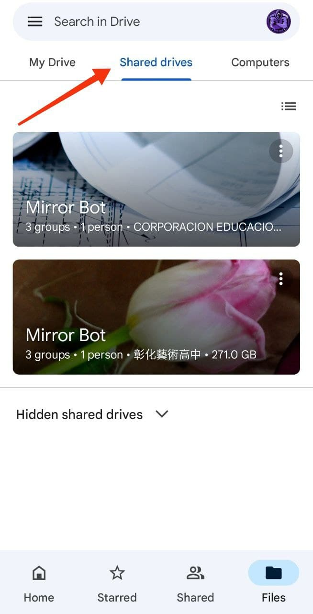

# Mirror Bot Access 🔐
Lets get your Access to Mirror-Bot's Cloud to easily access your requested Files from Google Drive itself.😊
## ⚙️ How to Get ?
<h4><b> 1.First you have to join our Mirror Bot's Google Group! <a href=""> Join Now!</a></b></h4>
<h4><b> 2.To Join the Group just click the above given button "Join Now!" and click Join button on Google Group's Site.</b></h4>
<h4><b> 3.After you join the Group, you will automatically get your access.</b></h4>
<h3> 🗳️ Use Google Drive to access!</h3>
<h4><b> 1.After you joined the group! Now Go to "Google Drive" app for Android or IOS.</b></h4>
<h4><b> 2.Or you can use Website to access Shared Drive on your PC or Laptop.</b></h4>
<h4><b> 3.Now if you are using App, then Refresh it and click Shared Drive Tab Button as shown in the Image.</b></h4>
 <!---Img already exist that's why--->
<h4><b> 4.Or, If you are using Website from PC or Laptop, then click Shared Drive from Sub Menu.</b></h4>
 <!---Img already exist that's why--->
<h4><b> 5.After following steps, you will see that Shared Drive Named "Mirror Bot" open it.</b></h4>
<h2> 📥 Download Google Drive</h2>
<h4> <b>For Android 📱: <a href="https://play.google.com/store/apps/details?id=com.google.android.apps.docs" alt="Download-for-Android"> Download</a></b></h4>
<h4> <b>For IOS 📟: <a href="https://apps.apple.com/in/app/google-drive-online-backup/id507874739"> Download</a></b></h4>
<h2>⛑Contact Us!</h2>
<h4><b>Don't Forget to checkout my Official Website: <a href="https://www.caduceus.ml">Check Out!</a></b></h4>
<h4>Join our Update Channel at Telegram:<a href="https://telegram.me/TheCaduceusUPDATE"> Join Now!</a>
<h4>Directly Contact the Developer using Telegram <a href="https://telegram.me/HelpAutomatted_Bot">@HelpAutomatted_Bot</a></h4>
